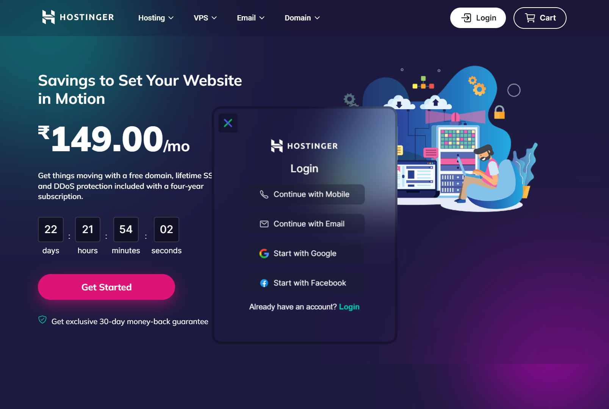

###### Hey there 👋
###### I'm Shyam, a CE student and creative coder and self-proclaimed designer. I make it my mission to translate user-focused designs into pixel-perfect websites.





### I made [hostinger.in](https://hostinger.in) landing page design using HTML,CSS and JavaScript

>I Deployed my Project on Netlify and Vercel. so you can check it out 👇
<br> [https://hostingerr.netlify.app/](https://hostingerr.netlify.app/) `recommended`
<br> [https://hostingerr.vercel.app/](https://hostingerr.vercel.app/)

### 📌Resources and and its corresponding CDN links
- <b>Fonts(Inter,Mulis and Roboto)</b>
    ```css
    @import url('https://fonts.googleapis.com/css2?family=Inter:wght@100;200;300;400;500;600;700&family=Mulish:wght@200;300;400;500;600;700;800;900&family=Roboto:wght@100;300;400;500;700&display=swap');
    ```
 - <b>CSS Variables</b>
    ```css
    :root
    {
        --primary:#00d0b0;

        --bg:#1d1a40;
        --bg-2:rgba(0, 0, 0, 0.275);
        --bg-3:rgba(23, 29, 49, 0.429);
        --bg-4:rgba(0, 0, 0, 0.105);
        --bg-5:rgba(0, 0, 0, 0.405);
        --bg-6:rgba(0, 0, 0, .2);
        --bg-7:rgba(0, 0, 0, 0.2);

        --font-white:#ffffff;
        --font-dark:#000000;
        --font-gray:rgba(255, 255, 255, 0.817);

        --font-primary:#2f1c6a;
        --font-secondary:#554685;

        --font-roboto:'Roboto', sans-serif;
        --font-inter:'Inter', sans-serif;
        --font-mulis:'Mulish', sans-serif;

        --btn-primary:#ffffff;
        --btn-secondary:rgb(220, 20, 117);

        --mt:3rem;

        --scroll-thumb:#00d0b0;
    }
        ```


- <b>ION Icon Js CDN</b>
    ```html
    <script type="module" src="https://unpkg.com/ionicons@5.5.2/dist/ionicons/ionicons.esm.js"></script>
    <script nomodule src="https://unpkg.com/ionicons@5.5.2/dist/ionicons/ionicons.js"></script>
    ```

- <b>Swiper slider style</b>
    ```html
    <link rel="stylesheet" href="https://cdn.jsdelivr.net/npm/swiper@8/swiper-bundle.min.css" />
    ```
- <b>Swiper Js CDN</b>
    ```html
    <script src="https://cdn.jsdelivr.net/npm/swiper@8/swiper-bundle.min.js"></script>
    ```
- <b>AOS Style</b>
    ```html
     <link rel="stylesheet" href="https://unpkg.com/aos@next/dist/aos.css" />
    ```
- <b>AOS Js CDN</b>
    ```html
    <script src="https://unpkg com/aos@next/dist/aos.js"></script>
    <script>
        AOS.init();
    </script>

    ```

## What I Learned from this Project?

- I learned lot from this project. This types of projects create color sance in my mind.
- learned about how can make pixel perfect web design 
- In this landing page I used [swiper js](https://swiperjs.com/) . By using this JS plugins I learned how can make responsive slider and responsive card slider.
- I learned about backdrop-filter css property.
- I learned lot about DOM manipulation. 


## This Project took around 14:00 Hours ⏲️ to complate.

## Author

- [@shyamtala](https://github.com/shyamtala003)